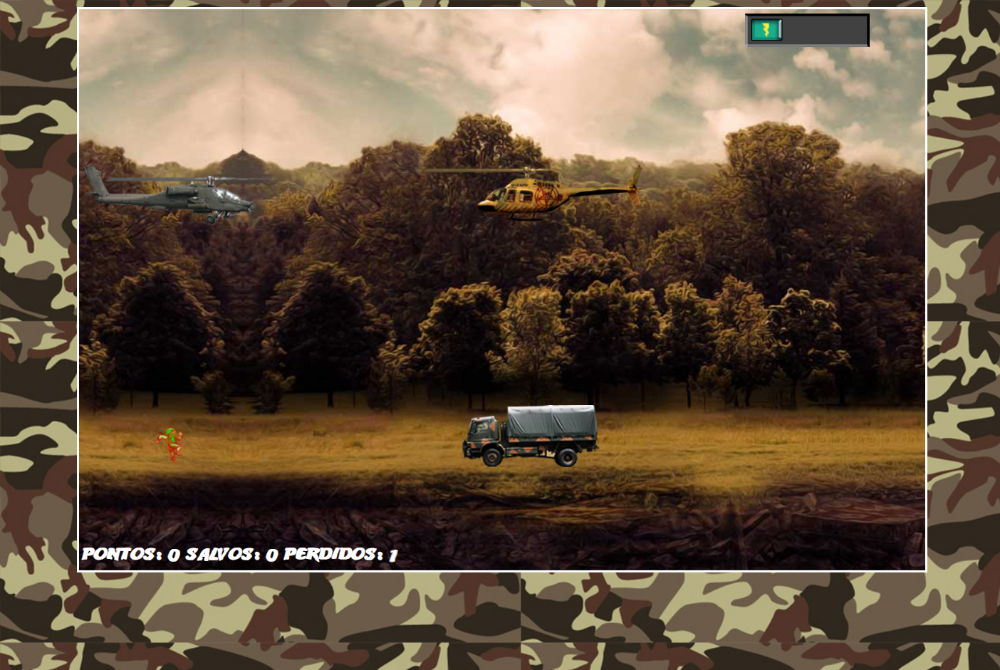

# Projeto Jogo de Naves e Resgate

> Plataforma Digital Innovation One 

 Projeto realizado durante o Bootcamp Javascript Game Developer - DIO, foi criado um jogo de naves e resgate.
 Desenvolvido 24/12/21.

[📎 Clique aqui para acessar] (https://michel-maia.github.io/Projeto-Jogo-de-Naves-e-Resgate)

 ## Tecnologias 🖥️ 🚀 

- HTML
- CSS
- JavaScript
- Git e GitHub

